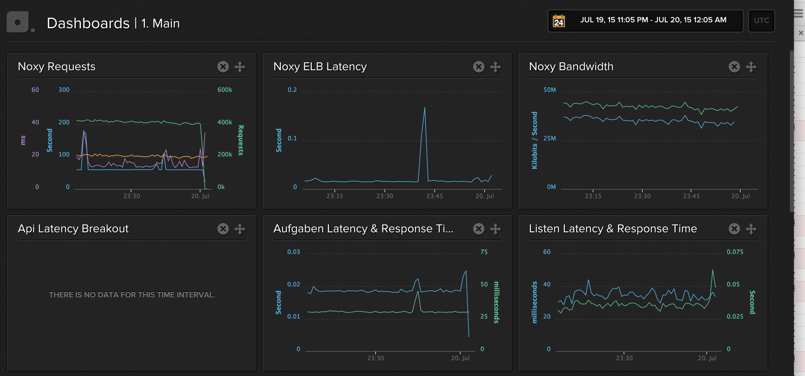

# [fit] The Wunderlist (backend) Architecture 

---

# [fit] A Very Brief History

---

# [fit] Wunderlist 1

---

## PHP + MySQL


^ Monolithic inter-dependent application
  Monolithic relational database
  Added two slightly monolithic services towards the end

---

# [fit] Wunderlist 2

---

## Rails + Postgres


^ Monolithic inter-dependent application
  Monolithic relational database
  Added two slightly monolithic services towards the end

---

# [fit] Wunderlist 3

---


^ currently > 600 total machine instances running in these services

---


---

* Multi-layered
* Many small databases
* Tiny services
* Heterogeneous by default
* Disposable code
* Immutable Infrastructure
* Convention over Configuration
* Asynchronous/Synchronous

^ interesting aspects we'll cover


---


^ Multi-layered

---


^ Multi-layered

---

# [fit] Break big problems into many tiny problems

---

# [fit] Many small databases

^ 34 relational databases, plus a few redis and dynamodb
^ What about RI? What about joins? OMG!!


---

# [fit] Tiny Services

^ Here come two examples

---

# [fit] "aufgaben"

---

```ruby
Aufgaben::Application.routes.draw do
  get '/api/health' => ->(env){
    [200, {"Content-Type" => "application/json"}, ['{"up":true}']]
  }

  namespace :api do
    namespace :v1 do
      resources :tasks
    end
  end
end
```

---

```ruby
class Api::V1::TasksController < ApplicationController
  before_filter :reject_conflicts, only: [:update, :destroy]

  def create
    attributes = Coor.create! attributes: create_params, client: current_client_info
    stats.increment :task, :create
    respond_with_created TaskRepresentation.new(task: attributes).to_hash
  end

  # ...
end
```

---

`Task` recently moved from `aufgaben` to `coor`.

```ruby
class Task < ActiveRecord::Base
  attr_accessor :completed

  validates :list_id, presence: true
  validates :direct_owner_id, presence: true
  validates :title, presence: true, length: 1..255
  validates :created_by_request_id, uniqueness: true, allow_nil: true
  validate :do_not_allow_due_dates_very_far_in_the_future

  # ...
end
```

---

# [fit] "tasks"

---

```
GET     /api/v1/tasks                controllers.Tasks.index
GET     /api/v1/tasks/:id            controllers.Tasks.show(id: Long)
POST    /api/v1/tasks                controllers.Tasks.create
PATCH   /api/v1/tasks/:id            controllers.Tasks.update(id: Long)
PUT     /api/v1/tasks/:id            controllers.Tasks.update(id: Long)
DELETE  /api/v1/tasks/:id            controllers.Tasks.delete(id: Long, revision: Long)
```

---

```scala
trait TasksController extends Controller {
  def index = Authenticated.async { implicit req =>
    for {
      tasks <- fetchTasks
    } yield Ok(serializeTasks(tasks))
  }

  def show(id: Long) = Authenticated.async  { implicit req =>
    for {
      task <- fetchTask(id)
    } yield Ok(Json.toJson(task.write))
  }

  implicit val taskCreateReads = Json.reads[IncomingTaskCreateParams]

  def create = Authenticated.async(parse.json)  { implicit req =>
    for {
      params        <- parseBody(taskCreateReads.reads)
      _             <- hasPermissions(Some(params.listId), req.userId, false)
      outgoingParams = Some(outgoingCreateParams(params))
      task          <- Api("aufgaben", "v1").post("/tasks", outgoingParams).as[Task]
    } yield Created(taskWrites.writes(task.write))
  }

  // ...
}
```

---

# [fit] Heterogeneous By Default

---

# [fit] Why?

^ Use the best tool for the job
  Prepare for upgrades and technology shift. Historically hard. Do hard things all the time.
  Reduce silly dogma.
  Fun and employee passion/motivation.

---

# [fit] Challenges?

^ Takes some getting used to to context-shift.
  Tooling and deployment more of a pain than the languages themselves.
  Need people who are willing to learn fast.

---

# [fit] "What about shared libraries?"

---

# [fit] No

---

# Service vs Library

**Logging**

stdout | go logger | syslog | rsyslog cluster

---

# Service vs Library

**Metrics**

statsd | librato

---

**Serialization**

Migrating from a ruby gem to a ruby service for mutations

```ruby
class TaskRepresentation
  include Rep

  initialize_with :task

  fields [
    :id,
    :assignee_id,
    :completed,
    :completed_at,
    :completed_by_id,
    :created_at,
    :created_by_id,
    :created_by_request_id,
    :recurrence_type,
    # ...
  ] => :default
end
```

---

# Doesn't this cause performance problems?

---



^ Talk about how much easier it is to identify, scale, etc. with separate processes
 And other stuff.  (Yes, but IPC isn't what slows us down)


---

# [fit] Disposable Code

^ Cellular regeneration analogy.  Code isn't the asset--system is the asset.  Let go of unhealthy attachment to implementation.

---

# Really...

More than half of our services have been updated or rewritten since we launched

^ No disruption. No Big Rewrite

---


# [fit] Immutable Infrastructure

^ Never upgrade software on an existing server. Kill and replace it.
  Like a cell in a biological system


---

# Deployment: wake

```sh
$ cd aufgaben

$ wake pack
+ some output while installing the app code or binary
dockersha

$ wake deploy --sha dockersha -n 6
+ creates hosts if necessary
+ deploys 6 instances

$ wake count
6

$ wake expand -n 3
+ creates hosts if necessary
+ deploys 3 instances
9

$ wake contract -n 3
+ terminates 3 instances (oldest first)
6


```

---

# Deployment: wake

```sh
$ wake replace --sha dockersha
+ counts current instances
+ deploys current amount
+ contracts

$ wake count
6

$ wake scale -n 12
+ counts current instances
+ if current value is more than 12, runs contract
+ else if current value is less than 12, runs expand
+ in this case, it would expand
```

---

# Deployment: awake

* Github commit hook | build container
* Button to replace
* Button to scale

---


---

# Convention Over Configuration

---

# Version in url
## `/api/v1/tasks`

---

# Flat routes
## `/api/v1/tasks?list_id=123`
### _no regexps, no nesting, use query params_

---

# [fit] Shared `api-client` for HMAC, discovery

---

# [fit] Shared `api-controller` for permissions, `null` removal

---

# Every change creates a mutation object

```json
{
  "recipient_id": 123456,
  "version": 1,
  "type": "mutation",
  "data": {
    "created_by_id": 123456,
    "revision": 1,
    "starred": false,
    "completed": false,
    "is_recurrence_child": false,
    "title": "Hello Microservices",
    "updated_at": "2015-07-16T17:44:51.735Z",
    "created_by_request_id": "...",
    "id": 123456,
    "list_id": 123456,
    "created_at": "2015-07-16T17:44:51.735Z"
  },
  "operation": "create",
  "subject": {
    "id": 123456,
    "type": "task",
    "revision": 1,
    "previous_revision": 0,
    "parents": [{
      "id": 123456,
      "type": "list"
    }]
  }
}
```

# [fit] Every object has a `type`, `id`, and `revision` property

---

# Synchronous & Asynchronous

Request

```json
{
  "type": "request",
  "verb": "POST",
  "uri": "/api/v1/tasks",
  "headers": {
    ...
  },
  "body":
    "{\"title\":\"HI\",
      \"list_id\":105529866,
      \"starred\":false,
      \"recurrence_count\":0,
      \"recurrence_type\":\"\",
      \"completed\":false,
      \"created_at\":\"2014-06-26T12:30:27Z\",
      \"selected\":false,
      \"active\":false}"
}
```

^ Every request is synchronous from the HTTP LB down to the database
  Yet every request is async because of hahn and the websocket

---

# Synchronous & Asynchronous

Response

```json
{
  "status": 200,
  "headers": {
    ...
  },
  "body":
    "{\"title\":\"HI\",
      \"list_id\":105529866,
      \"starred\":false,
      \"recurrence_count\":0,
      \"recurrence_type\":\"\",
      \"completed\":false,
      \"created_at\":\"2014-06-26T12:30:27Z\",
      \"selected\":false,
      \"active\":false}"
}
```

^ Every request is synchronous from the HTTP LB down to the database
  Yet every request is async because of hahn and the websocket


---

* Multi-layered
* Many small databases
* Tiny services
* Heterogeneous by default
* Disposable code
* Immutable Infrastructure
* Convention over Configuration
* Asynchronous/Synchronous

---

# Questions?

*credits:* @myobie + @duncan for some slides and content

*slides:* https://github.com/chad/microservices-group-talk/tree/wunderlist-backend-architecture-at-microsoft-talk
