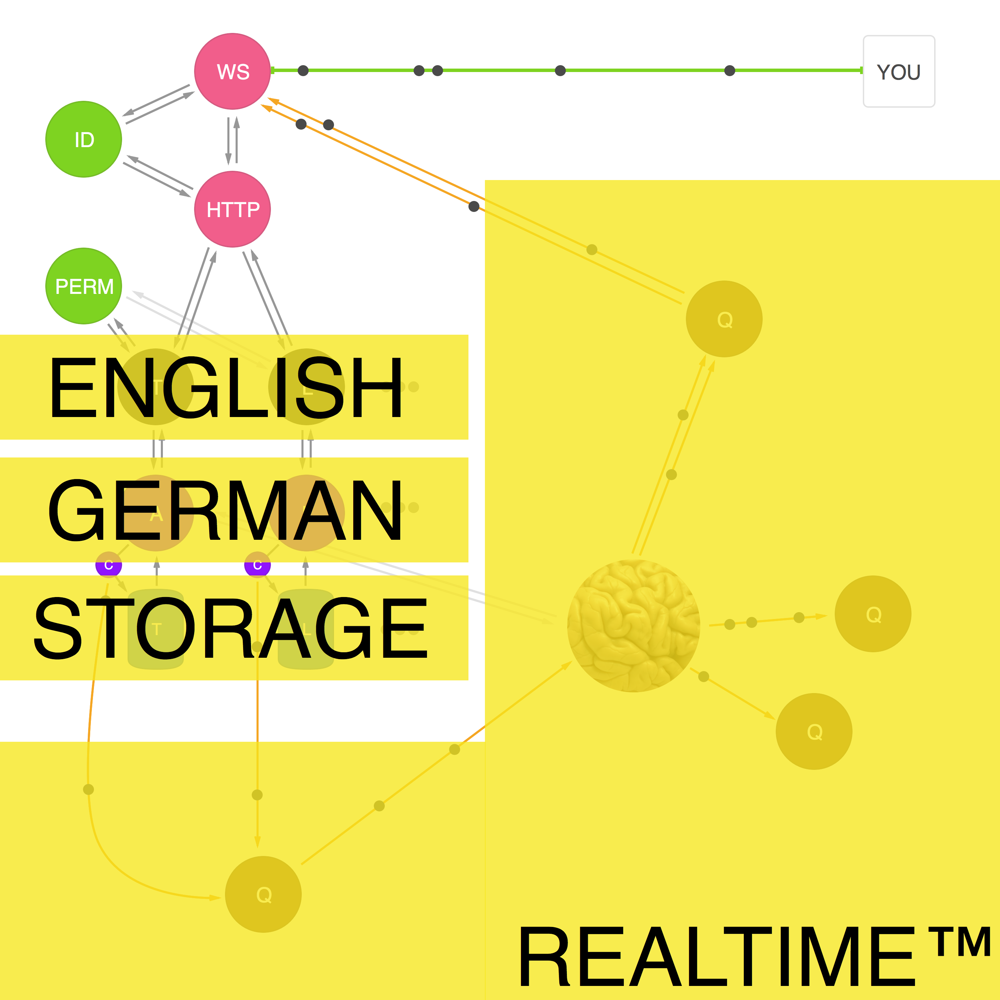
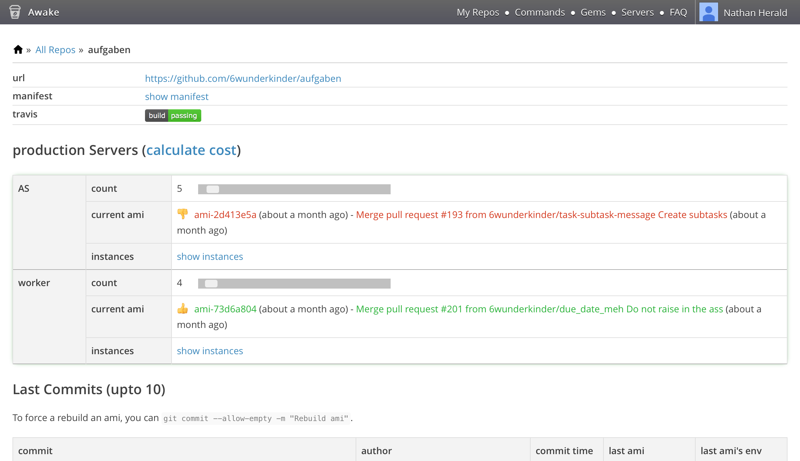

# [fit] Microservices at Wunderlist

---

# Background: Wunderlist 2

* Monolithic inter-dependent application
* Monolithic relational database
* Added two slightly monolithic services towards the end

---


---


---



---

# [fit] Synchronous & Asynchronous

---

# Every change generates a mutation

```json
{
  "recipient_id": 123456,
  "version": 1,
  "data": {
    "created_by_id": 123456,
    "revision": 1,
    "starred": false,
    "completed": false,
    "is_recurrence_child": false,
    "title": "Hello Microservices",
    "updated_at": "2015-07-16T17:44:51.735Z",
    "created_by_request_id": "...",
    "id": 123456,
    "list_id": 123456,
    "created_at": "2015-07-16T17:44:51.735Z"
  },
  "operation": "create",
  "subject": {
    "id": 123456,
    "type": "task",
    "revision": 1,
    "previous_revision": 0,
    "parents": [{
      "id": 123456,
      "type": "list"
    }]
  },
  "client": {
    "id": "abc...",
    "request_id": "...",
    "device_id": "...",
    "instance_id": "...",
    "user_id": "123456"
  },
  "type": "mutation"
}
```

---

# Object Oriented Server Architecture

```ruby
class TaskFetch
  def get(id:)                              # GET /api/v1/tasks/123
  end

  def all(list_id:)                         # GET /api/v1/tasks
  end
end

class TaskWrite
  def create(attributes:)                   # POST /api/v1/tasks
  end

  def update(id:, attributes:)              # PUT /api/v1/tasks/123
  end

  def delete(id:)                           # DELETE /api/v1/tasks/123
  end

  private def valid?(attributes:)
  end
end
```

---

# Object Oriented Server Architecture

```ruby
class Tasks
  def get(id:)
    Api(:aufgaben, :v1).get("tasks/#{id}").as(Task) do |task|
      Api(:exestenz, :v1).get("exists", list_id: task.list_id, user_id: user_id).success?
    end
  end
end
```

---

# Deployment: wake

```sh
$ cd aufgaben

$ wake pack
+ some output while installing the app code or binary
dockersha

$ wake deploy --sha dockersha -n 6
+ creates hosts if necessary
+ launches 6 instances

$ wake count
6

$ wake expand -n 3
+ creates hosts if necessary
+ launches 3 instances
9

$ wake contract -n 3
+ terminates 3 instances (oldest first)
6


```

---

# Deployment: wake

```sh
$ wake replace --sha dockersha
+ counts current instances
+ launches current amount
+ contracts

$ wake count
6

$ wake scale -n 12
+ counts current instances
+ if current value is more than 12, runs contract
+ else if current value is less than 12, runs expand
+ in this case, it would expand
```

---

# Deployment: awake

* Github commit hook | build container
* Button to replace
* Button to scale

---



---

# [fit] Example core service: aufgaben

---

```ruby
Aufgaben::Application.routes.draw do
  get '/api/health' => ->(env){ [200, {"Content-Type" => "application/json"}, ['{"up":true}']] }
  namespace :api do
    namespace :v1 do
      resources :tasks
    end
  end
end
```

---

```ruby
class Api::V1::TasksController < ApplicationController
  before_filter :reject_conflicts, only: [:update, :destroy]

  def create
    attributes = Coor.create! attributes: create_params, client: current_client_info
    stats.increment :task, :create
    respond_with_created TaskRepresentation.new(task: attributes).to_hash
  end

  # ...
end
```

---

```ruby
class Task < ActiveRecord::Base
  attr_accessor :completed

  validates :list_id, presence: true
  validates :direct_owner_id, presence: true
  validates :title, presence: true, length: 1..255
  validates :created_by_request_id, uniqueness: true, allow_nil: true
  validate :do_not_allow_due_dates_very_far_in_the_future

  # ...
end
```

---

# [fit] Example core service: tasks

---

```
GET     /api/v1/tasks                controllers.Tasks.index
GET     /api/v1/tasks/:id            controllers.Tasks.show(id: Long)
POST    /api/v1/tasks                controllers.Tasks.create
PATCH   /api/v1/tasks/:id            controllers.Tasks.update(id: Long)
PUT     /api/v1/tasks/:id            controllers.Tasks.update(id: Long)
DELETE  /api/v1/tasks/:id            controllers.Tasks.delete(id: Long, revision: Long)
```

---

```scala
trait TasksController extends Controller {
  def index = Authenticated.async { implicit req =>
    for {
      tasks <- fetchTasks
    } yield Ok(serializeTasks(tasks))
  }

  def show(id: Long) = Authenticated.async  { implicit req =>
    for {
      task <- fetchTask(id)
    } yield Ok(Json.toJson(task.write))
  }

  implicit val taskCreateReads = Json.reads[IncomingTaskCreateParams]

  def create = Authenticated.async(parse.json)  { implicit req =>
    for {
      params        <- parseBody(taskCreateReads.reads)
      _             <- hasPermissions(Some(params.listId), req.userId, false)
      outgoingParams = Some(outgoingCreateParams(params))
      task          <- Api("aufgaben", "v1").post("/tasks", outgoingParams).as[Task]
    } yield Created(taskWrites.writes(task.write))
  }

  // ...
}
```

---

# [fit] Example stream service: webhooks

---

# Polyglot Development

---

# Why?  

^ Use the best tool for the job
Prepare for upgrades and technology shift. Historically hard. Do hard things all the time.
Reduce silly dogma.
Fun and employee passion/motivation.

---

# Challenges?  

^ Takes some getting used to to context-shift.
Tooling and deployment more of a pain than the languages themselves.
Need people who are willing to learn fast.

---

# "What about shared libraries?"

---

# No

---

# Service vs Library

**Logging**

  stdout | syslog | rsyslog cluster

---

# Service vs Library

**Metrics**

  statsd | librato

---

**Serialization**

  Migrating from a ruby gem to a ruby service for mutations

---

# Conventions

* Version in url (`/api/v1/tasks`)
* Flat routes (no regexps, no nesting, use query params)
* Shared `api-client` for HMAC, discovery
* Shared `api-controller` for permissions, `null` removal
* Every change creates a mutation object
* Shared service for writes for emitting mutations (coordinator)
* Every object has a `type`, `id`, and `revision` property

---

# Questions?
