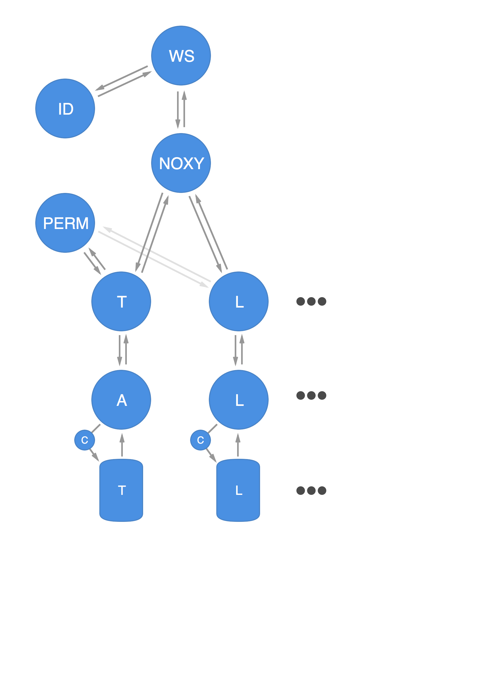

# Microservices at Wunderlist

---

# Background: Wunderlist 2

* Monolithic inter-dependent application
* Monolithic relational database
* Added two slightly monolithic services towards the end

---



---

# Synchronous & Asynchronous

---

# Every change generates a mutation

```json
{
  "recipient_id": 123456,
  "version": 1,
  "data": {
    "created_by_id": 123456,
    "revision": 1,
    "starred": false,
    "completed": false,
    "is_recurrence_child": false,
    "title": "Hello Microservices",
    "updated_at": "2015-07-16T17:44:51.735Z",
    "created_by_request_id": "...",
    "id": 123456,
    "list_id": 123456,
    "created_at": "2015-07-16T17:44:51.735Z"
  },
  "operation": "create",
  "subject": {
    "id": 123456,
    "type": "task",
    "revision": 1,
    "previous_revision": 0,
    "parents": [{
      "id": 123456,
      "type": "list"
    }]
  },
  "client": {
    "id": "abc...",
    "request_id": "...",
    "device_id": "...",
    "instance_id": "...",
    "user_id": "123456"
  },
  "type": "mutation"
}
```

---

# Object Oriented Server Architecture

```ruby
class TaskFetch
  def get(id:)
  end

  def all(list_id:)
  end
end

class TaskWrite
  def create(attributes:)
  end

  def update(id:, attributes:)
  end

  def delete(id:)
  end
end

class TaskPermissions
  def verify?(id:)
  end
end
```

---

# Deployment: wake

```sh
$ cd aufgaben

$ wake pack
+ some output while installing the app's code or binary
dockersha

$ wake deploy --sha dockersha -n 6
+ creates hosts if necessary
+ launches 6 instances

$ wake count
6

$ wake expand -n 3
+ creates hosts if necessary
+ launches 3 instances
9

$ wake contract -n 3
+ terminates 3 instances (oldest first)
6


$ wake replace --sha dockersha
+ counts current instances
+ launches current amount
+ contracts
```

---

# Deployment: awake

---

# Polyglot

Why?  
Challenges?  
"Shared code"?

---

# Example core service: aufgaben

---

# Example stream service: webhooks

---

# Services vs Libraries

* Logging

  stdout | syslog | rsyslog cluster

* Metrics

  statsd | librato

* Serialization

  Migrating from a ruby gem to a ruby service for mutations

---

# Conventions

* Version in url (`/api/v1/tasks`)
* Flat routes (no regexps, no nesting, use query params)
* Shared `api-client` for HMAC, discovery
* Shared `api-controller` for permissions, `null` removal
* Shared service for writes for emitting mutations (coordinator)
* Every object has a `type`, `id`, and `revision` property
